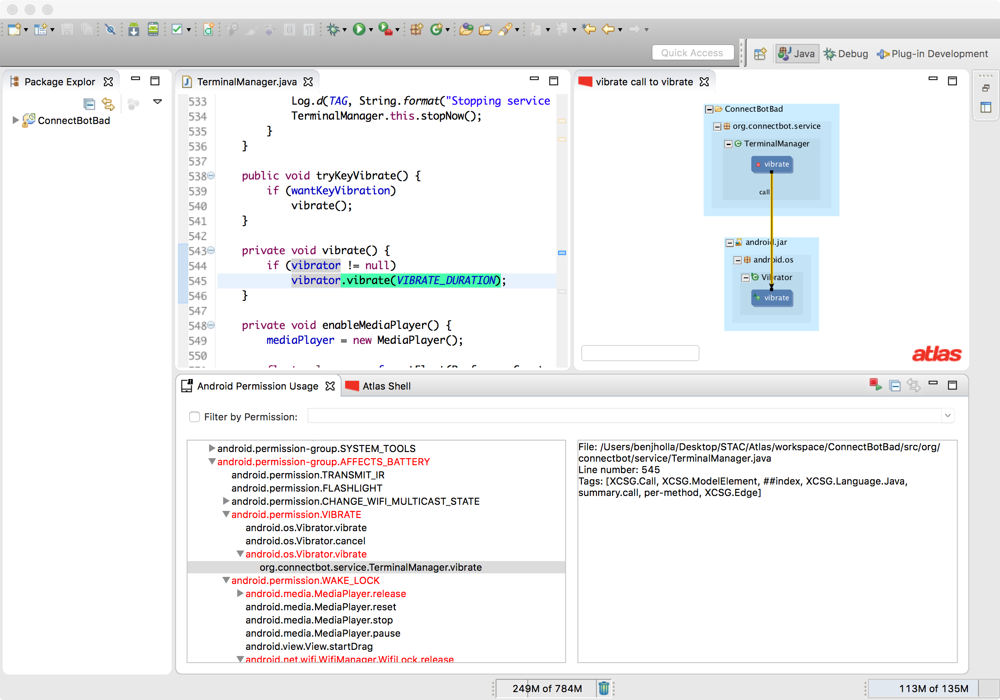

The Android Essentials Toolbox is a collection program analysis tools specifically developed for analyzing Android applications. The toolbox aids in mapping Android Permission Groups and Protection Levels to Permissions as well as Permissions to the respective permission protected Android APIs.

**Website:** [https://ensoftcorp.github.io/android-essentials-toolbox](https://ensoftcorp.github.io/android-essentials-toolbox/)

The Android Essentials Toolbox aims to make program analysis of Android apps simpler. The most useful features are outlined below.

- Includes documented (public) and undocumented (private) [Permissions](https://developer.android.com/reference/android/Manifest.permission.html), [Permission Groups](https://developer.android.com/reference/android/Manifest.permission_group.html), and [Protection Levels](https://developer.android.com/guide/topics/manifest/permission-element.html#plevel)
- `Permission` Java object that encodes Android Permissions and their attributes (simple/qualified name, description, API level, and deprecation status) and maps the `Permission` to the corresponding permission protected API methods (based on the results of the University of Toronto's [PScout](http://pscout.csl.toronto.edu/) tool)
- `PermissionGroup` Java object that encodes Android Permission Groups with their attributes (simple/qualified name, description, API level, and deprecation status) and maps the `PermissionGroup` to the corresponding `Permission` objects
- `ProtectionLevel` Java object that encodes Android Protection Levels with their attributes (name, description, and protection level) and maps the `ProtectionLevel` to the corresponding `Permission` objects
- Support for seamlessly applying and querying the encoded relationships in the [Atlas](http://www.ensoftcorp.com/atlas/) program graph
- Support for locating and parsing the [Android Manifest](https://developer.android.com/guide/topics/manifest/manifest-intro.html) in the Eclipse workspace
- Support for multiple [Android API versions](https://source.android.com/source/build-numbers.html)

The toolbox also includes a Permission Usage View that shows used permissions in red (categorized by permission group and protection level). At the lowest level of the tree is the callsite of the application method that called the permission protected method.

