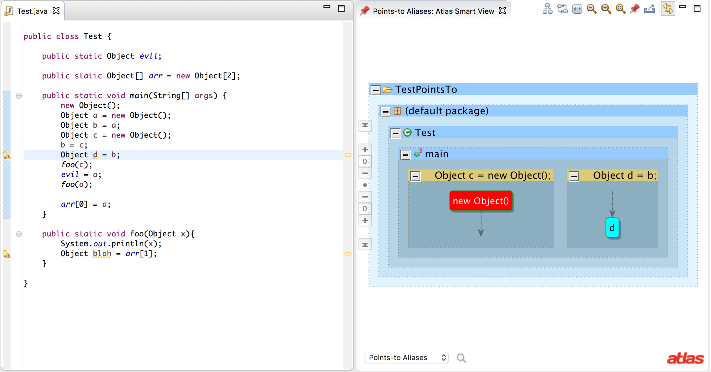

The Points-to Toolbox project is an Atlas native points-to analysis implementation and utilities for using the points-to analysis results for other client analyses. This plugin implements an Andersen-style points-to analysis.

**Website:** [https://ensoftcorp.github.io/points-to-toolbox](https://ensoftcorp.github.io/points-to-toolbox/)

## Features
- Automatic analysis following Atlas program graph generation
- User configurable analysis preferences
- Atlas Smart Views for viewing points-to results on-demand
- Program Graph Enhancements: 
	- Rewrites data flows through array components
	- Refines Class Hierarchy Analysis (CHA) based call graphs
- Client analysis access to: 
	- *Points-To Aliases* 
	- *Points-To Instantiations*
	- *Points-To Types*

