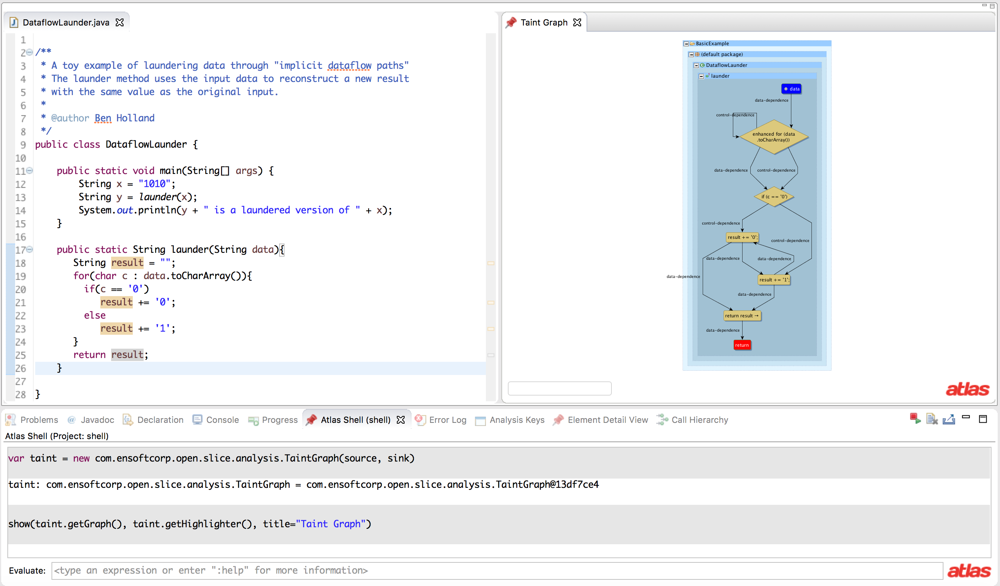

The Slicing Toolbox project provides Atlas native Program Dependence Graph (PDG) based [program slicing](https://en.wikipedia.org/wiki/Program_slicing). The PDG is a combination of analysis on control and data flow graphs that makes the both control and data flow dependencies explicit.

The Slicing Toolbox project supports the following.

- Forward Dominance Tree ([Post Dominance](https://en.wikipedia.org/wiki/Dominator_(graph_theory)#Postdominance)) analysis
- Reverse and forward Control Dependence Graph (CDG) slices
- Reverse and forward Data Dependence Graph (DDG) slices
- Reverse and forward Program Dependence Graph (PDG) slices
- Convenient Smart Views for viewing slice results
- Source to sink taint analysis (includes [implicit information flow](https://en.wikipedia.org/wiki/Information_flow_(information_theory)))
- Smart views for CDG, DDG, and PDG slices

