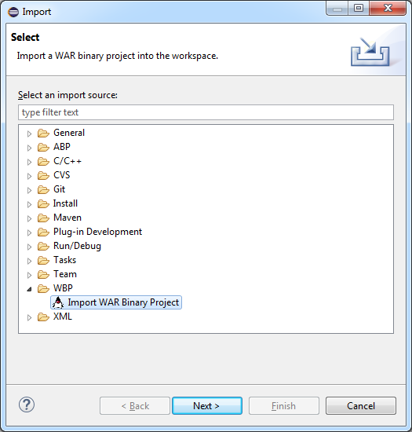

The [WAR Binary Processing](https://ben-holland.com/AtlasWBP/) project is a frontend plugin built on top of Atlas to add support for processing [Java WAR](https://en.wikipedia.org/wiki/WAR_%28file_format%29) binaries for use in program analysis.

**Website:** [https://ben-holland.com/AtlasWBP](https://ben-holland.com/AtlasWBP/)

The plugin features include the following.

- Import Wizard for processing Java WARs into analyzable Atlas Jimple projects
- Extensible support for multiple JSP translator platforms
- Tested pre-compilation support for Tomcat 6, 7, 8, and 9

