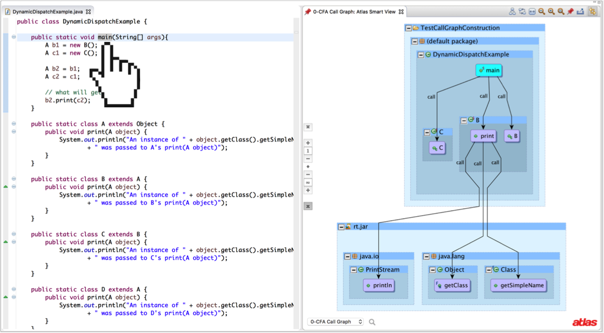

The Call Graph Toolbox project is a collection of Atlas native call graph construction implementations and utilities for navigating the resulting call graphs. This plugin implements 9 different call graph construction algorithms ranging from Class Hierarchy Analysis (CHA) to Rapid Type Analysis (RTA) to Variable Type Analysis (VTA).

**Website:** [https://ensoftcorp.github.io/call-graph-toolbox](https://ensoftcorp.github.io/call-graph-toolbox/)

This plugin features:

- User configurable analysis preferences for whole and partial program analysis
- Atlas Smart Views for viewing call graph results on-demand
- 9 different call graph construction algorithms

