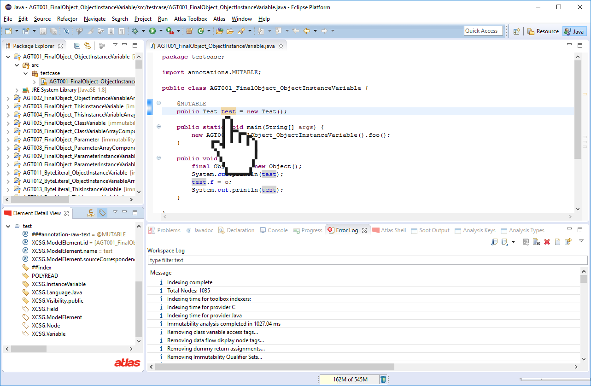

The Immutability Toolbox seeks to answer the question: *given code C and reference R, is the object O referenced by R mutated in the code C?*. The toolbox contains robust implementations of two prominent approaches to immutability analysis. The first approach leverages a precise points-to analysis computed by the Points-to Toolbox to resolve aliasing relationships and compute object immutability. The second approach is a scalable type inference based approach.

**Website:** [https://ensoftcorp.github.io/immutability-toolbox](https://ensoftcorp.github.io/immutability-toolbox/)

This plugin features:

- **Extensible Analysis:** Both immutability analyses classify and tag references as *READONLY*, *POLYREAD*, or *MUTABLE* to indicate the immutability of the referenced object. *POLYREAD* is used to represent context-sensitive results where a mutation may occur in one context but not another. These tags are queryable by any client analysis requiring immutability analysis results.
- **Method Purity:** From the results of the immutability analysis, the toolbox also computes method purity (a method that does not mutate objects that existed before the method invocation). Pure methods are tagged as *PURE*, whereas methods with mutation side effects are not.
- **Partial Program Analysis:** Both implementations support partial program analysis (e.g. analysis of libraries).
- **Well Tested:** Both approaches have been rigorously tested and evaluated.

